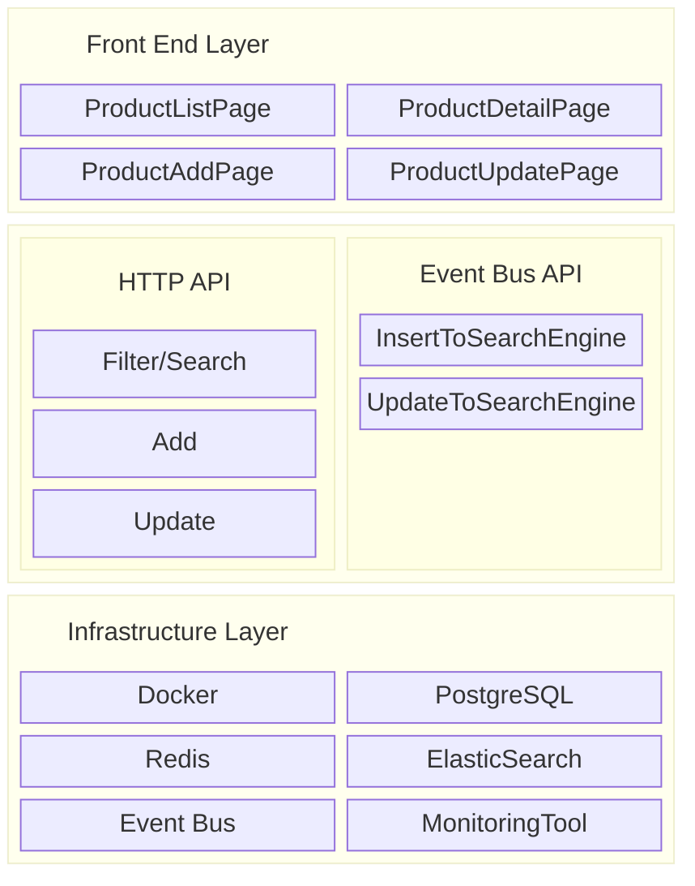

# solomon

Solomon is a simple web app to support product/item/merchandise gallery.

| Current covered features are |
| ------------- |
| 1. search product by any keyword |
| 2. filter product by price range |
| 3. pagination |
| 4. add / update product  |

## Technical Stack
Built with:
 Clean Architecture

NSQ Message Queue

## System Architecture

## Code Architecture
There are no backward arrows from inner to outer layer

